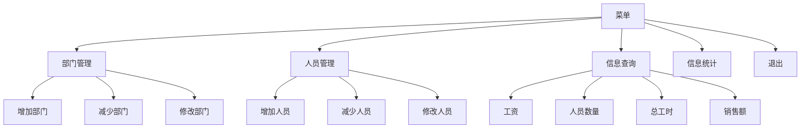

```mermaid
graph TD
MENU[菜单]-->DEPARTMENTMANAGE[部门管理]
	DEPARTMENTMANAGE-->DEPARTMENTADD[增加部门]
	DEPARTMENTMANAGE-->DEPARTMENTDEL[减少部门]
	DEPARTMENTMANAGE-->DEPARTMENTMODIFY[修改部门]
MENU[菜单]-->EMPLOYEEMANAGE[人员管理]
	EMPLOYEEMANAGE-->EMPLOYEEADD[增加人员]
	EMPLOYEEMANAGE-->EMPLOYEEDEL[减少人员]
	EMPLOYEEMANAGE-->EMPLOYEEMODIFY[修改人员]
MENU[菜单]-->信息查询[信息查询]
	信息查询-->工资
	信息查询-->人员数量
	信息查询-->总工时
	信息查询-->销售额
MENU[菜单]-->信息统计[信息统计]
MENU[菜单]-->退出

```

